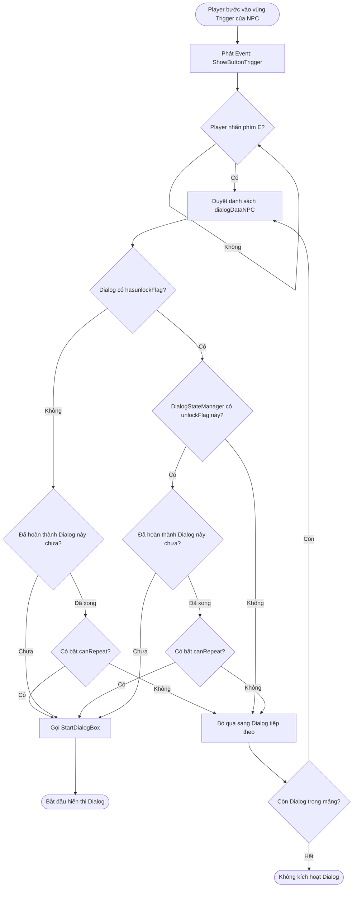
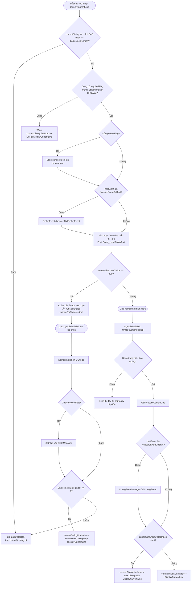
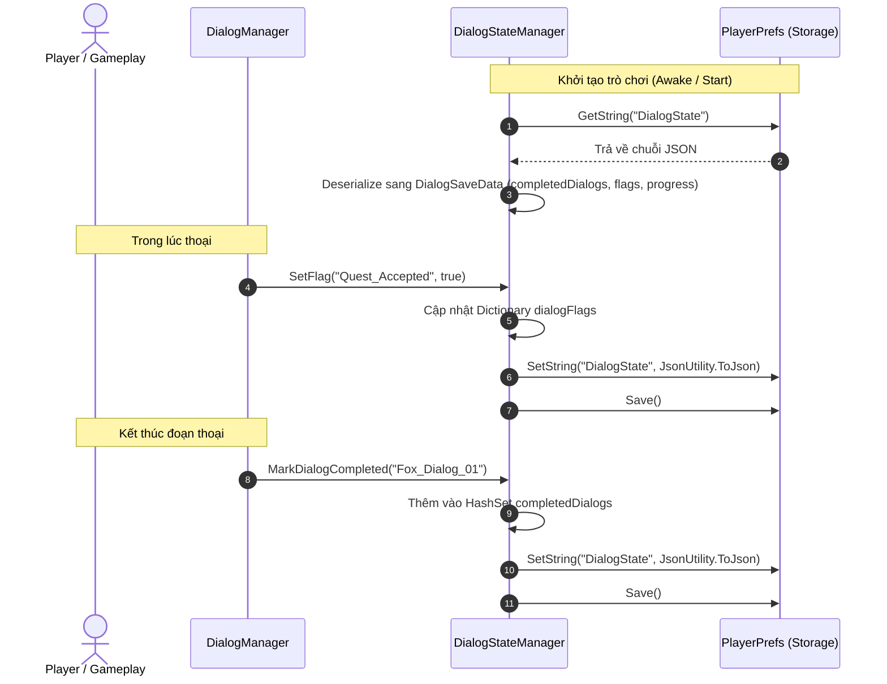

# HƯỚNG DẪN VÀ TÀI LIỆU HỆ THỐNG DIALOG (DIALOG SYSTEM)

Tài liệu này cung cấp thiết kế kiến trúc, sơ đồ flow hoạt động chi tiết và hướng dẫn sử dụng toàn diện cho hệ thống hội thoại (Dialog System) trong dự án.

---

## 1. TỔNG QUAN KIẾN TRÚC (ARCHITECTURE OVERVIEW)

Hệ thống hội thoại được xây dựng theo kiến trúc hướng dữ liệu (Data-driven) kết hợp State Machine và Event-driven:
- **Data Layer (ScriptableObject & Serialized Classes):** Quản lý cấu trúc dữ liệu thoại, lời thoại, các nhánh lựa chọn, cờ điều kiện (flags) và sự kiện (events).
- **Core Manager Layer:** 
  - `DialogManager`: Điều phối luồng hiển thị giao diện, lời thoại, hiệu ứng gõ chữ, và chuyển câu/nhánh.
  - `DialogStateManager`: Lưu trữ và duy trì trạng thái cờ (`flags`), hội thoại đã hoàn thành (`completedDialogs`), tiến trình (`dialogProgress`), tự động lưu/tải qua `PlayerPrefs` (JSON).
  - `DialogEventManager`: Kích hoạt các sự kiện gameplay đặc biệt (mở shop, drop item, new game) dựa trên tiến trình thoại.
- **Trigger Layer:**
  - `DialogTriggerNPC`: Kích hoạt thoại khi tương tác gần NPC (phím `E`).
  - `DialogIntro`: Kích hoạt thoại mở đầu (intro / cutscene), tự chuyển scene khi hoàn thành.
- **UI & Event Layer:**
  - `ListButtonChoices`: Quản lý danh sách các nút lựa chọn phân nhánh.
  - `EventManager.OP_EventManager`: Giao tiếp lỏng (decoupled) với hệ thống UI hiển thị text, icon gợi ý tương tác và các hệ thống khác trong game.

```
                    +------------------------------------+
                    |       DialogData (SO)              |
                    |  - dialogLines                     |
                    |  - conditions & branching          |
                    +-----------------+------------------+
                                      |
                                      v
+---------------------+     +--------------------+     +-----------------------+
|  DialogTriggerNPC   | --> |   DialogManager    | <-> |  DialogStateManager   |
|  / DialogIntro      |     | (UI & Line Flow)   |     |  (Flags & Save/Load)  |
+---------------------+     +---------+----------+     +-----------------------+
                                      |
                 +--------------------+--------------------+
                 |                                         |
                 v                                         v
     +-----------------------+                 +-----------------------+
     |  DialogEventManager   |                 | EventManager (Global) |
     |  (Shop, Item, Game)   |                 | - Event_LoadDialogText|
     +-----------------------+                 | - UI Choice Buttons   |
                                               +-----------------------+
```

---

## 2. CHI TIẾT CÁC THÀNH PHẦN (SYSTEM COMPONENTS)

### 2.1. Nhóm Dữ liệu (Data Layer)
- **`DialogData` (ScriptableObject):**
  - `characterName` (string): Tên nhân vật/NPC đang nói.
  - `characterSprite` (Sprite): Ảnh chân dung nhân vật.
  - `dialogID` (string): Mã định danh duy nhất của đoạn hội thoại (dùng để lưu tiến độ và kiểm tra hoàn thành).
  - `hasunlockFlag` (bool) & `unlockFlag` (string): Nếu bật, đoạn thoại chỉ kích hoạt khi cờ tương ứng đã được bật trong `DialogStateManager`.
  - `canRepeat` (bool): Cho phép lặp lại đoạn thoại khi người chơi tương tác lại sau khi đã hoàn thành.
  - `dialogLines` (DialogLine[]): Mảng các dòng thoại.

- **`DialogLine` (Serializable):**
  - `dialogText` (string - TextArea): Nội dung câu thoại hiển thị.
  - `hasChoice` (bool) & `choices` (DialogChoice[]): Danh sách lựa chọn phân nhánh cho người chơi.
  - `nextDialogIndex` (int): Chỉ số dòng thoại tiếp theo (mặc định `-1` để chạy tuần tự theo thứ tự mảng).
  - `requiredFlag` (string): Cờ điều kiện bắt buộc để dòng này được phát. Nếu không thỏa mãn, hệ thống tự động nhảy qua dòng tiếp theo.
  - `setFlag` (string): Tự động bật cờ này khi dòng thoại bắt đầu hiển thị.
  - `hasEvent` (bool) & `dialogEvents` (DialogEvent[]): Danh sách sự kiện đính kèm câu thoại.
  - `executeEventOnStart` (bool): `true` = kích hoạt sự kiện ngay khi câu thoại xuất hiện; `false` = kích hoạt khi người chơi nhấn Next để kết thúc câu thoại.

- **`DialogChoice` (Serializable):**
  - `choiceText` (string): Nội dung hiển thị trên nút lựa chọn.
  - `requiedFlag` (string): Cờ bắt buộc để hiển thị nút lựa chọn này.
  - `setFlag` (string): Cờ sẽ được kích hoạt khi người chơi click lựa chọn này.
  - `nextDialogIndex` (int): Chỉ số dòng thoại chuyển đến sau khi chọn (`-1` = kết thúc hội thoại ngay).

- **`DialogSaveData` / `DialogFlags` / `DialogProgress`:**
  - Đối tượng cấu trúc tuần tự hóa (Serializable) dùng để đóng gói dữ liệu JSON lưu vào `PlayerPrefs` với key `"DialogState"`.

### 2.2. Nhóm Quản lý (Core Managers)
- **`DialogManager`:**
  - `StartDialogBox(DialogData dialogData, int indexDialog = 0)`: Bật hộp thoại UI và bắt đầu phát từ dòng chỉ định.
  - `DisplayCurrentLine()`: Kiểm tra cờ điều kiện, kích hoạt `setFlag`, gọi sự kiện `executeEventOnStart`, phát event `Event_LoadDialogText`, hiển thị các nút lựa chọn (nếu có).
  - `ProcessCurrentLine()`: Kích hoạt sự kiện kết thúc dòng thoại (nếu có), chuyển sang `nextDialogIndex` hoặc tăng `currentDialogLineIndex++`.
  - `OnChoiceSelected(DialogChoice choice)`: Xử lý khi người chơi bấm nút lựa chọn.
  - `OnNextButtonClicked()`: Xử lý nút bấm Next thoại (hoặc hoàn tất gõ text nếu đang typing).
  - `EndDialogBox()`: Đánh dấu `dialogID` hoàn thành vào `DialogStateManager`, ẩn nút lựa chọn và đóng UI.

- **`DialogStateManager` (Singleton):**
  - Quản lý `completedDialogs` (HashSet), `dialogFlags` (Dictionary) và `dialogProgress` (Dictionary).
  - Các hàm tiện ích: `SetFlag(flag, value)`, `HasFlag(flag)`, `IsDialogCompleted(id)`, `MarkDialogCompleted(id)`, `ResetAllStateDialog()`, `SaveDialogState()`, `LoadDialogState()`.

- **`DialogEventManager` (Singleton):**
  - Thực thi các tác vụ game đặc biệt từ enum `DialogEventType`:
    - `None`: Không có gì.
    - `ShowShop`: Phát `Event_OpenShop`.
    - `DropItem`: Logic rơi vật phẩm.
    - `NewGame`: Khởi tạo ván chơi mới qua `GameControl.Instance.NewGame()`.

### 2.3. Nhóm Kích hoạt (Triggers)
- **`DialogTriggerNPC` (BaseInteraction):**
  - Nhận diện Player trong vùng Trigger Collider 2D, phát event hiển thị nút bấm gợi ý (`Event_ShowButtonTrigger`).
  - Khi bấm `E`: duyệt qua danh sách `dialogDataNPC`, kiểm tra các điều kiện `hasunlockFlag`, `unlockFlag`, `IsDialogCompleted` và `canRepeat` để chọn đoạn thoại phù hợp nhất để phát.
  - Khi rời khỏi vùng va chạm: tự động đóng hộp thoại.
- **`DialogIntro` (BaseInteraction):**
  - Dùng trong phân cảnh mở đầu. Nếu thoại chưa hoàn thành sẽ phát thoại; nếu đã hoàn thành sẽ chuyển trực tiếp sang scene tiếp theo (`_nameScene`).

---

## 3. SƠ ĐỒ FLOW HOẠT ĐỘNG (FLOWCHARTS)

### 3.1. Sơ đồ Kích hoạt Hội thoại NPC (NPC Dialog Trigger Flow)



---

### 3.2. Sơ đồ Xử lý Lời thoại & Phân nhánh (Line Display & Branching Flow)



---

### 3.3. Sơ đồ Lưu trữ & Phục hồi Trạng thái (Save & Load Flow)



---

## 4. HƯỚNG DẪN SỬ DỤNG TỪNG BƯỚC (STEP-BY-STEP USAGE GUIDE)

### Bước 1: Tạo ScriptableObject `DialogData`
1. Trong cửa sổ **Project**, click chuột phải tại thư mục mong muốn (ví dụ: `Assets/Script/DialogSystem/DialogData/DialogSO/...`).
2. Chọn **Create > Dialogue > DialogData**.
3. Đặt tên file (ví dụ: `NPC_Elder_Dialog_01`).
4. Cấu hình Inspector:
   - `Character Name`: Tên nhân vật (ví dụ: `"Trưởng Làng"`).
   - `Character Sprite`: Ảnh đại diện chân dung.
   - `Dialog ID`: ID duy nhất (ví dụ: `"Elder_Quest_Intro"`).
   - `Hasunlock Flag`: Bật `true` nếu thoại này cần điều kiện cờ để mở khóa.
   - `Unlock Flag`: Tên cờ (ví dụ: `"Talked_To_Guard"`).
   - `Can Repeat`: Đánh dấu `true` nếu muốn NPC nói lại đoạn này khi người chơi tương tác lại.

---

### Bước 2: Thiết lập danh sách câu thoại (`dialogLines`)
Trong asset `DialogData`, mở mảng `Dialog Lines` và cấu hình từng phần tử:

#### 1. Câu thoại thông thường:
- `Dialog Text`: Nhập nội dung câu nói.
- `Next Dialog Index`: Để `-1` để tự động chạy sang dòng kế tiếp (index + 1).

#### 2. Câu thoại có sự kiện (Event):
- `Has Event`: Tích chọn `true`.
- `Dialog Events`: Thêm phần tử, chọn `Event Type` (ví dụ: `ShowShop`, `DropItem`, `NewGame`).
- `Execute Event On Start`:
  - `true`: Kích hoạt sự kiện ngay khi câu nói vừa hiện ra.
  - `false`: Kích hoạt sự kiện sau khi người chơi đọc xong và ấn Next.

#### 3. Câu thoại có điều kiện kiểm tra Cờ (Flag):
- `Required Flag`: Chỉ hiển thị dòng này nếu người chơi đã có cờ tương ứng (ví dụ: `"Has_Key"`). Nếu chưa có, dòng này sẽ bị bỏ qua và nhảy sang dòng tiếp theo.
- `Set Flag`: Tự động bật cờ này khi câu thoại bắt đầu hiển thị (ví dụ: `"Elder_Quest_Accepted"`).

#### 4. Câu thoại phân nhánh lựa chọn (Choices):
- `Has Choice`: Tích chọn `true`.
- `Choices`: Thêm các lựa chọn cho người chơi:
  - `Choice Text`: Nội dung nút bấm (ví dụ: `"Tôi đồng ý giúp"`).
  - `Requied Flag`: Cờ điều kiện cần có để nút này hiển thị (để trống nếu luôn hiển thị).
  - `Set Flag`: Cờ được bật khi người chơi nhấn nút này (ví dụ: `"Accepted_Help"`).
  - `Next Dialog Index`: Chỉ số dòng thoại sẽ nhảy tới (ví dụ: dòng `3` nếu đồng ý, dòng `5` nếu từ chối; hoặc `-1` để kết thúc hội thoại ngay).

---

### Bước 3: Thiết lập trên Scene (Scene Setup)

#### 1. Setup `DialogManager` & UI Canvas:
1. Tạo một GameObject tên `DialogManager` (hoặc đặt trên Canvas UI).
2. Gắn script `DialogManager.cs`.
3. Gán các trường trên Inspector:
   - `Dialog Box`: GameObject hộp thoại (panel chứa text và avatar).
   - `Button Next Dialog`: Nút Next để chuyển câu tiếp theo. Gắn sự kiện `Button.onClick` gọi đến hàm `DialogManager.OnNextButtonClicked()`.
4. Trên GameObject con của hộp thoại, tạo một Panel chứa các nút lựa chọn và gắn script `ListButtonChoices.cs`.
   - Gán mảng `Array Button Choices` với danh sách các Button lựa chọn đã tạo sẵn.

#### 2. Setup `DialogStateManager` & `DialogEventManager`:
1. Tạo một GameObject quản lý (hoặc đặt chung trong hệ thống Manager tổng).
2. Gắn `DialogStateManager.cs` và `DialogEventManager.cs`.
3. Cả 2 class đều kế thừa `Singleton<T>`, tự động duy trì instance toàn cục (`DialogStateManager.dialogState_Instance` và `DialogEventManager.dialogEvent_Instance`).

#### 3. Setup trên NPC (`DialogTriggerNPC`):
1. Trên GameObject của NPC, thêm `Collider2D` và tích chọn **Is Trigger**.
2. Gắn component `DialogTriggerNPC.cs`.
3. Trong mảng `Dialog Data NPC`, kéo các asset `DialogData` theo thứ tự ưu tiên kiểm tra:
   - Ví dụ:
     - Element 0: `Elder_Quest_Complete` (yêu cầu `unlockFlag = "Boss_Defeated"`)
     - Element 1: `Elder_Quest_In_Progress` (yêu cầu `unlockFlag = "Quest_Accepted"`)
     - Element 2: `Elder_Quest_Intro` (không yêu cầu flag, chỉ phát lần đầu)
     - Element 3: `Elder_Idle_Talk` (không yêu cầu flag, `canRepeat = true`)

---

## 5. BẢNG TRA CỨU SỰ KIỆN & CỜ (EVENT & FLAG REFERENCE)

### 5.1. Các Event toàn cục (qua `EventManager.OP_EventManager`)
| Tên Event | Kiểu dữ liệu | Mô tả |
| :--- | :--- | :--- |
| `NameEvent.Event_LoadDialogText` | `string` | Bắn nội dung câu thoại hiện tại để UI Text hiển thị / chạy hiệu ứng typewriter. |
| `NameEvent.Event_ShowButtonTrigger` | Không có param | Kích hoạt hiển thị icon nhắc nhở người chơi nhấn `[E]` khi đến gần NPC. |
| `NameEvent.Event_HiddenButtonTrigger` | Không có param | Ẩn icon nhắc nhở khi người chơi rời xa NPC. |
| `NameEvent.Event_OpenShop` | Không có param | Mở UI Cửa hàng (khi event thoại là `ShowShop`). |

### 5.2. Các loại sự kiện hội thoại (`DialogEventType`)
| Giá trị Enum | Hành động thực thi | Hàm gọi |
| :--- | :--- | :--- |
| `None` | Không thực hiện gì | - |
| `ShowShop` | Mở giao diện cửa hàng | `EventManager.OP_EventManager.TriggerEvent(NameEvent.Event_OpenShop)` |
| `DropItem` | Rơi vật phẩm từ NPC/nhiệm vụ | Hook logic rơi item |
| `NewGame` | Bắt đầu ván chơi mới | `GameControl.Instance.NewGame()` |

---

## 6. HƯỚNG DẪN MỞ RỘNG (EXTENDING THE SYSTEM)

### Thêm một loại Dialog Event mới:
1. Mở file `DialogEventType.cs`, thêm enum mới:
   ```csharp
   public enum DialogEventType 
   {
       None,
       ShowShop,
       DropItem,
       NewGame,
       GiveQuestReward // Sự kiện mới
   }
   ```
2. Mở file `DialogEventManager.cs`, bổ sung case xử lý vào switch-case của hàm `CallSingleEvent`:
   ```csharp
   case DialogEventType.GiveQuestReward:
       GiveReward();
       break;
   ```
3. Định nghĩa hàm thực thi `GiveReward()` theo logic gameplay của dự án.

---

## 7. MỘT SỐ LƯU Ý QUAN TRỌNG KHI SỬ DỤNG
1. **Lỗi chính tả trường biến trong ScriptableObject:**
   - Trong `DialogChoice.cs`, trường cờ điều kiện có tên là `requiedFlag` (thiếu ký tự `r`). Khi lập trình hoặc tạo script can thiệp, hãy chú ý dùng đúng tên trường `choice.requiedFlag`.
2. **Thứ tự sắp xếp trong `dialogDataNPC`:**
   - Khi tương tác, hàm `TriggerDialog()` sẽ duyệt từ trên xuống dưới mảng. Luôn xếp các đoạn thoại có điều kiện (`hasunlockFlag = true`) hoặc ưu tiên cao lên trước các đoạn thoại mặc định/idle.
3. **Reset dữ liệu khi Test:**
   - Do dữ liệu được tự động lưu vào `PlayerPrefs`, nếu muốn reset lại từ đầu để test luồng thoại mới, hãy gọi hàm:
     `DialogStateManager.dialogState_Instance.ResetAllStateDialog();`
